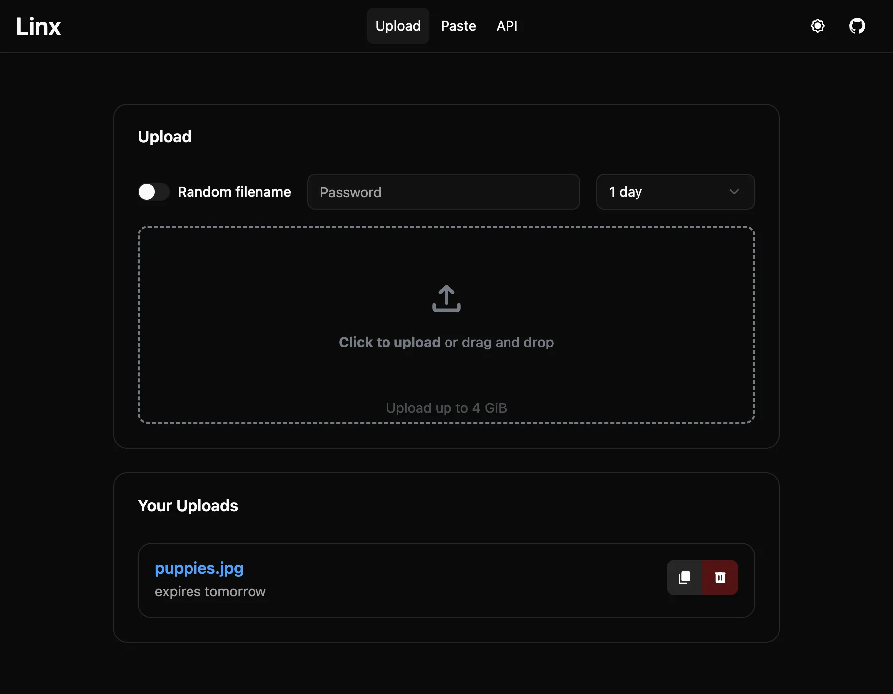
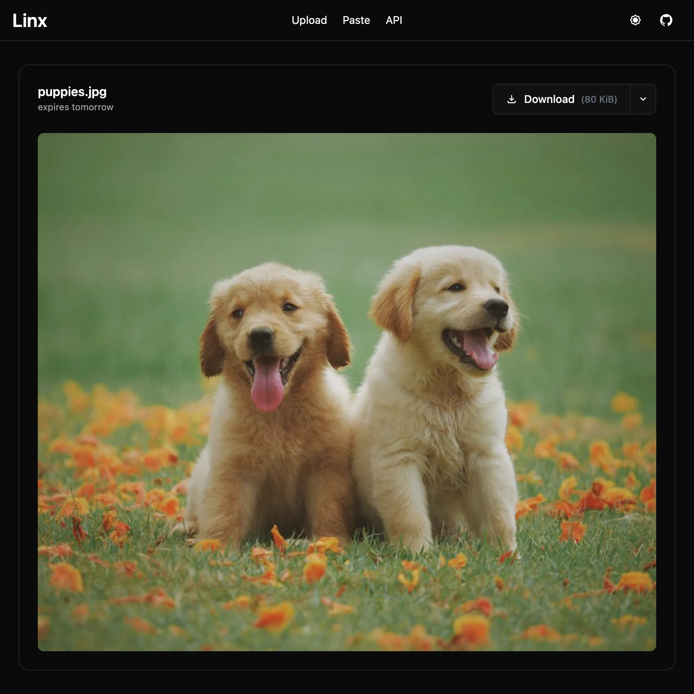
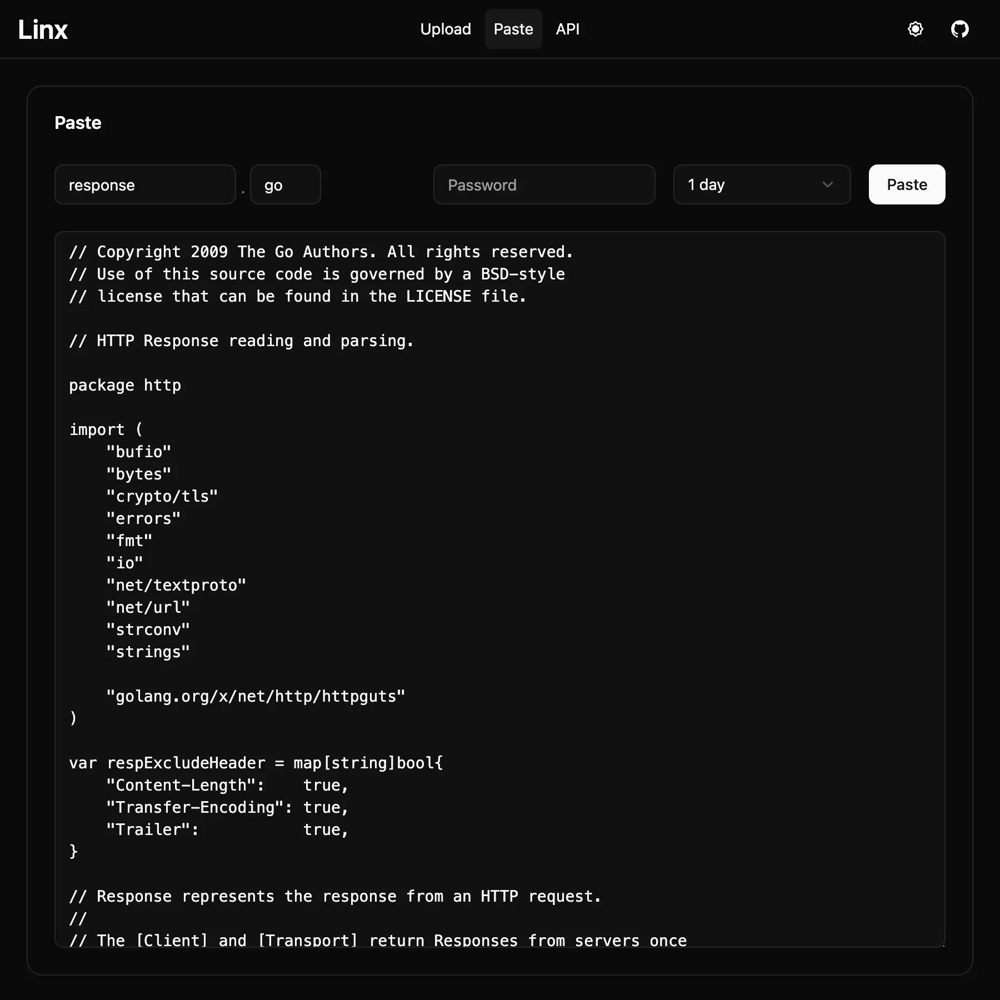
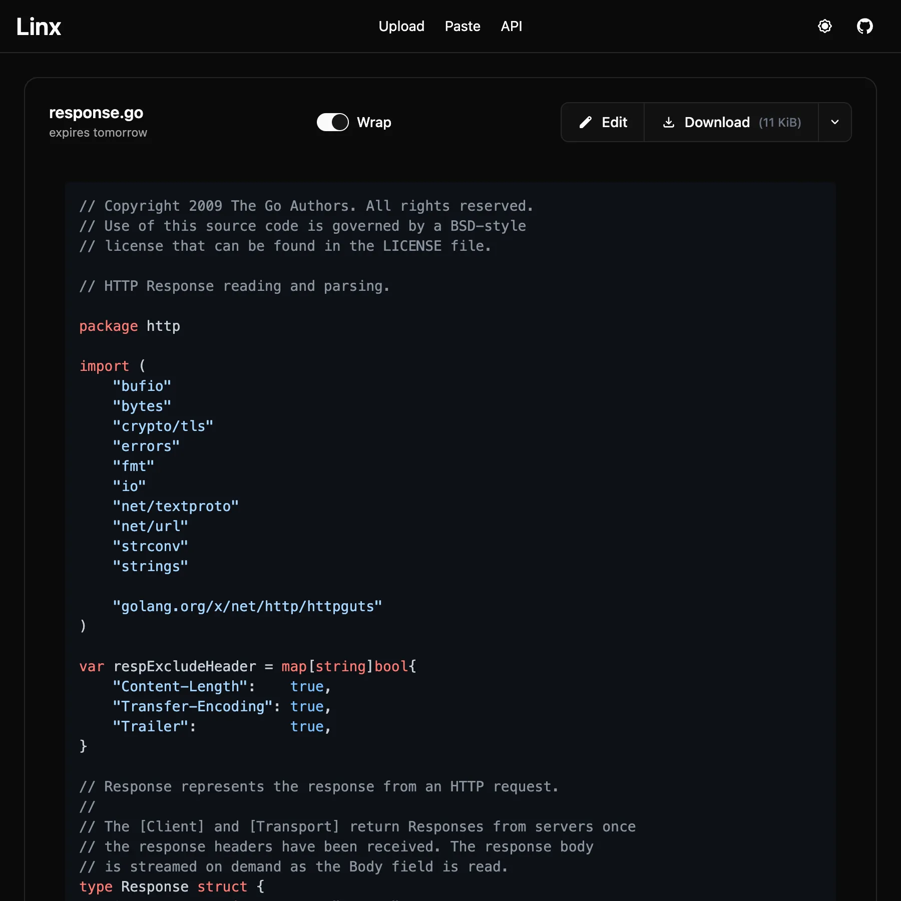
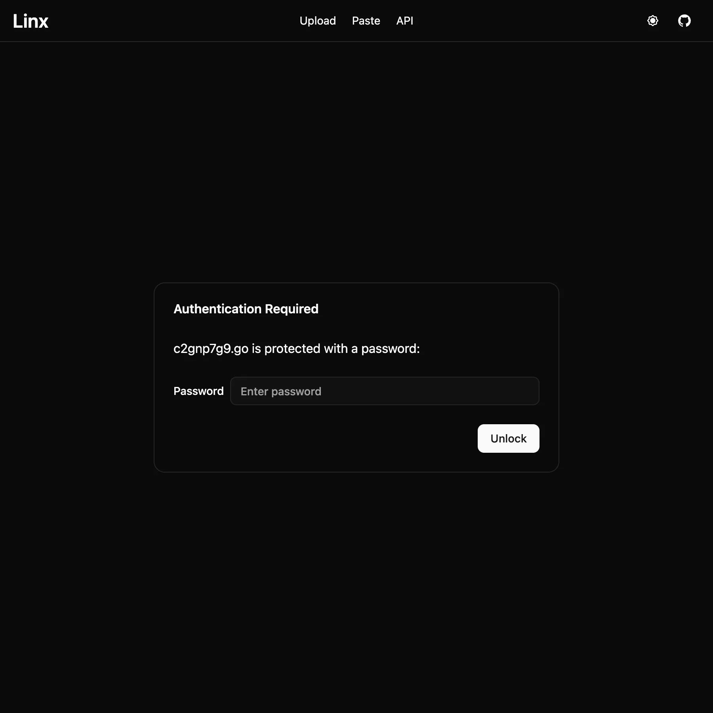

# linx-server

[](https://github.com/gabe565/linx-server/actions/workflows/build.yaml)

Self-hosted file/media sharing website.

### Clients
**Official**
- CLI: **linx-client** - [Source](https://github.com/andreimarcu/linx-client)

**Unofficial**
- Android: **LinxShare** - [Source](https://github.com/iksteen/LinxShare/) | [Google Play](https://play.google.com/store/apps/details?id=org.thegraveyard.linxshare)
- CLI: **golinx** - [Source](https://github.com/mutantmonkey/golinx)


### Features
- Display common filetypes (image, video, audio, markdown, pdf)  
- Display syntax-highlighted code with in-place editing
- Documented API with keys for restricting uploads
- Torrent download of files using web seeding
- File expiry, deletion key, file access key, and random filename options


### Screenshots
<picture>
  <source media="(prefers-color-scheme: light)" srcset="assets/readme/upload_light.webp">
  
</picture>
<br>
<picture>
  <source media="(prefers-color-scheme: light)" srcset="assets/readme/image_file_light.webp">
  
</picture> <picture>
  <source media="(prefers-color-scheme: light)" srcset="assets/readme/paste_light.webp">
  
</picture> <picture>
  <source media="(prefers-color-scheme: light)" srcset="assets/readme/text_file_light.webp">
  
</picture> <picture>
  <source media="(prefers-color-scheme: light)" srcset="assets/readme/auth_light.webp">
  
</picture>

## Getting started

### Using Docker
1. Create `data` directory and run `chown -R 65534:65534 data`
2. Optionally, create a config file ([example](config_example.toml)), we'll refer to it as `config.toml` in the following examples

Example running
```shell
docker run \
  -p 8080:8080 \
  -v /path/to/config.toml:/data/config.toml \
  -v /path/to/data:/data \
  ghcr.io/gabe565/linx-server
```

Example with Docker Compose:
```yaml
services:
  linx-server:
    container_name: linx-server
    image: ghcr.io/gabe565/linx-server
    command: --config=/data/config.toml
    volumes:
      - /path/to/data:/data
      - /path/to/config.toml:/data/config.toml
    ports:
      - "8080:8080"
    restart: unless-stopped
```
Ideally, you would use a reverse proxy such as nginx or caddy to handle TLS certificates.

### Using a binary release

1. Grab the latest binary from the [releases](https://github.com/gabe565/linx-server/releases)
2. Run `linx-server --config=path/to/config.toml`


## Usage

### Configuration
All configuration options are accepted either as arguments or can be placed in a file as such (see [example](config_example.toml)):
```toml
bind = '127.0.0.1:8080'
site-name = 'myLinx'
max-size = '4 MiB'
max-expiry = '24h'
# ... etc
```
...and then run `linx-server --config=path/to/config.toml`

### Options
See the [example configuration file](config_example.toml) or the [command-line docs](docs/linx-server.md).

Any config can be provided as an environment variable by capitalizing it, changing `-` to `_`, and prefixing it with `LINX_`.

## Deployment
Linx-server supports being deployed in a subdirectory (ie. example.com/mylinx/) as well as on its own (example.com/).


### 1. Using the built-in http server
Run linx-server normally.

### 2. Using the built-in https server
Run linx-server with the `cert-file = path/to/cert.file` and `key-file = path/to/key.file` options.

## Author
- Andrei Marcu, https://andreim.net
- Gabe Cook, https://gabecook.com
